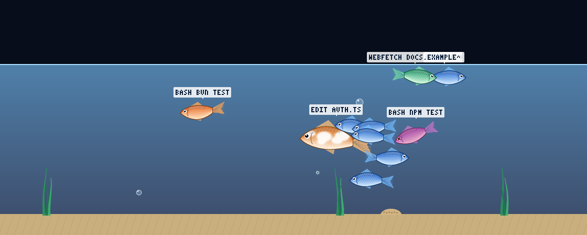

# Agent Aquarium

Claude Code の作業状態を、ターミナル内の水槽としてリアルタイムに描く Claude Mod（function hooks プラグイン）です。
メインループが親魚、サブエージェントが稚魚になり、ツール呼び出しがそのまま魚の動きになります。
**観測専用**で、ツールの実行結果には一切手を加えません。



（`bun run tools/preview.ts` が書き出した 140×28 セル時の 1 フレーム。動く様子は assets/preview.gif）

## 使い方

```sh
cd agent-aquarium
claude --plugin-dir .        # .claude/settings.json が CLAUDE_CODE_ENABLE_FUNCTION_HOOKS=1 を立てる
```

| コマンド | 動き |
|---|---|
| `/aquarium` | 水槽の表示 ON/OFF（pane 12 行） |
| `/aquarium full` | 大きい pane（28 行、fullscreen ではドックに 140 桁） |
| `/aquarium off` | 閉じる。次回セッションで自動再表示もしない |
| `/aquarium status` | 描画モード・サイズ・フレーム数・PNG サイズ |
| `/aquarium fps N` | フレームレート（2〜20、既定 12）。端末がもたつくなら下げる |
| `/aquarium mode kitty\|raster` | 描画方式を固定（引数なしで自動に戻す） |

一度 ON にすると、次のセッション開始時にも自動で開きます（pane を手で閉じるか `/aquarium off` で解除）。

## 何がどう動くか

| 対象 | 見た目 |
|---|---|
| 親魚（メインループ） | 錦鯉風 160×80px。水槽の中央を回遊 |
| 稚魚（サブエージェント） | 96×48px。`agent.spawn` と `$.agent.list()` で誕生、`turn.complete` で退場。最大 12 匹、超過分は「+N」バッジ |
| 稚魚の色 | Explore = 青、general-purpose = 橙、3 種目 = 緑、4 種目以降 = 紫 |

| ツール | 動き |
|---|---|
| Read / Grep / Glob | 水面から餌が落ち、食べに行く |
| Edit / Write | 泡を吐き、砂に巣が 1 つ増える |
| Bash | 1.2 秒だけ 3 倍速でダッシュ |
| WebFetch / WebSearch / MCP | 水面へ浮上 |
| エラー | 赤くなって震え、2 秒沈んで復帰 |

魚の上には `EDIT AUTH.TS` のようにツール名と引数が 1.5 秒出ます。
水位はコンテキスト使用率に連動して減り（`session.measure`）、compact で満水に戻ります。ターン中は水中が少し明るくなります。

## 描画方式

- pane に keyed な `<Image>` を 1 枚置き、`$.clock.every(66ms)` ごとに hooks 側でフレームを合成 → PNG にエンコード → `$.ui.blit({ png })` で差し替えます（既定 12fps、`/aquarium fps N` か plugin の設定 `fps` で変更）。Kitty graphics protocol の送信は Claude Code 本体が行います。
- hooks 環境には zlib も `CompressionStream` もないため、PNG のデコード（スプライト読込）とエンコード（固定 Huffman + LZ77 の deflate）は `hooks/aquarium/{inflate,deflate,png}.ts` の純 TypeScript 実装です。80×12 セルのフレームは約 20〜25 KB、合成 + エンコードで 8 ms ほどです。
- engine が Pane を再描画するとき（スピナー更新やリサイズ）は、最後に blit した画像をそのまま返します。再描画のたびに新しいフレームを返すと、フレームクロックと競合して画像がちらつくためです。
- 画像を出せない端末では `$.ui.blit` が拒否されるので、3 回続いたら `<Raster>` の半ブロック（▀）描画に自動で切り替えます。
- `/aquarium off`・pane を閉じる・セッション終了で pane を閉じ、画像の placement は本体側で消えます。

`Client` モジュール（描画スレッド）は `Image`/`Raster` を描けない仕様（`ClientElements`）なので、アニメーションループは hooks モジュール側に置いています。hooks モジュールは本体とは別の実行環境で動くため、プロンプト入力は塞ぎません。

## 構成

```
hooks/register.tsx          イベント配線だけ（session.start / command.run / ui.render(Pane) / ui.close /
                            tool.call / agent.spawn / turn.start / turn.complete / session.measure /
                            session.compact / session.end）
hooks/aquarium/world.ts     水槽の状態と物理（純関数）
hooks/aquarium/events.ts    ツール → アクション、ラベル、エージェント一覧との同期
hooks/aquarium/render.ts    合成（RGBA キャンバス）と半ブロック化
hooks/aquarium/sprites.ts   manifest.json からコマ矩形を引く、縮小
hooks/aquarium/png.ts       PNG デコード / エンコード、base64
hooks/aquarium/inflate.ts   deflate 展開
hooks/aquarium/deflate.ts   deflate 圧縮（固定 Huffman）
hooks/aquarium/font.ts      3×5 ピクセルフォント
assets/                     生成済みスプライト（tools/gen_sprites.py で再生成）
tools/preview.ts            合成結果を PNG に書き出す（Claude Code なしで確認）
tests/                      純ロジックのテスト（bun test）
```

## 開発

```sh
bun test                                      # 純ロジックのテスト
bun run tools/preview.ts                      # docs/ にフレームを書き出す
claude plugin validate .claude-plugin/plugin.json   # フック登録と $ 呼び出しの一覧
claude plugin validate .                      # marketplace manifest
```

型チェックはセッション内で `/plugin-types` を実行して `.claude/types/` を生成してから `tsc -p tsconfig.json`。
ヘッドレスでも生成できます: `claude -p "/plugin-types .claude/types"`。
編集はホットリロードされます（`register` が作り直される）。

## やらないこと

音、魚同士の当たり判定、スプライトの実行時生成。
