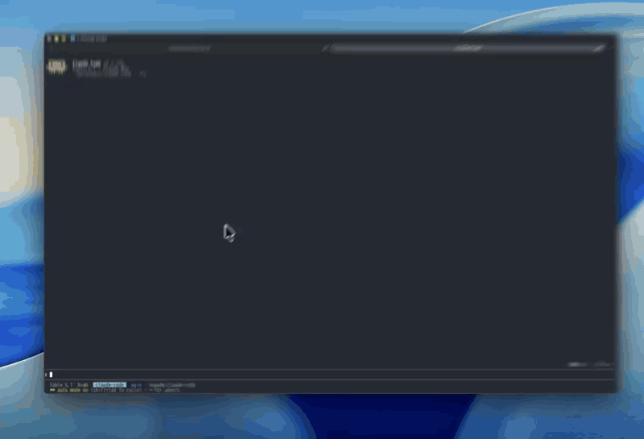

# git-ops

[日本語](README.ja.md)

A **Claude Mod** (a Claude Code plugin built on function hooks): `/git` draws a clickable git
panel in the band above the prompt. Pick a branch with a button, confirm, and it checks out —
plus pull / push / fetch, stage-all and commit, without typing a git command.



```
Git · main (origin/main, ahead 4)              ↓ pull  ↑ push  fetch  refresh
▸ branches (12)     changes (13)
checkout: type to filter…            ← previous branch
[ feat/sandbox-rewrite ]       [ feature/seo-optimization ]
[ fix/sandbox-trailing-slash ] ● main (current)
[ feat/github-link-card ]      [ pensive-lamport ]
```

It shells out to plain `git` through `$.process.run` (an argv array, never a shell string), so
it needs no auth or config of its own: whatever `git` already resolves in the current working
directory — remotes, credentials, upstream tracking — is what runs.

**Deliberately limited to safe, everyday operations:** status, branch listing, checkout
(existing or new branch), pull, push, fetch, stage-all, commit. No force-push, reset, rebase or
clean — a panel button shouldn't put a destructive operation one click away.

## Requirements

- A Claude Code build with function hooks, enabled with `CLAUDE_CODE_ENABLE_FUNCTION_HOOKS=1`.
  Function hooks are early-access and their API can change; builds without them simply ignore
  this plugin's hooks module.
- `git` on `PATH`, and a git repository as the working directory.
- The terminal surface (the panel passes through untouched on desktop/mobile).

## Install

```
/plugin marketplace add nogu66/claude-code
/plugin install git-ops@nogu-marketplace
```

Or try it without installing:

```sh
git clone https://github.com/nogu66/claude-code.git
cd claude-code/git-ops
claude --plugin-dir .        # .claude/settings.json here turns function hooks on
```

Then run `/git` inside any git repository.

## The panel

`/git` (or `/git show`) shows the panel; `/git stop` hides it.

**Move the keys into the panel first.** Opening the panel leaves your keystrokes with the normal
prompt — text meant for the filter box, or a digit hotkey, never reaches the panel. Press
**`ctrl+x tab`** to focus it; then Tab/arrows move, Enter presses, Esc returns to the prompt.
Mouse clicks only work where the terminal reports them (the fullscreen layout).

- **Title row** — current branch, upstream and ahead/behind on the left; `↓ pull`, `↑ push`,
  `fetch`, `refresh` on the right. They act on the current branch's existing upstream.
- **Tabs** — `branches (n)` and `changes (n)`. Only one body is drawn at a time, which keeps the
  band short.
- **`branches` tab** — built for getting to another branch quickly:
  - local branches, most recently committed-to first, as framed buttons in side-by-side columns;
    the current branch is a green `● name (current)` label instead;
  - **click** a button (or Tab to it and press Enter), or press its **digit** (`1`–`9`, the
    first nine switchable branches);
  - a **filter box**: typing narrows the list (exact match, then name prefix, then `/`-segment
    prefix, then substring), and the line beneath says what Enter will do —
    `Enter → checkout <best match>`, or `Enter → create new branch <name>` when nothing matches;
  - **`← previous branch`** — `git checkout -`;
  - **nothing switches without an OK**: every one of the above opens a confirmation first
    (`Check out <branch>?` · `[ OK ]` / `[ cancel ]`, hotkeys `y` / `n`), with a warning when
    there are uncommitted changes.
- **`changes` tab** — staged (green) on the left, unstaged (yellow) and untracked on the right;
  below them `+ stage all` (`git add -A`) and a **commit** box (Enter runs `git commit -m`).

Checkout asks first. **Everything else — pull, push, fetch, stage all, commit — runs the moment
you click or press Enter**, exactly as if you had typed the git command. `push` reaches outside
your machine.

## Text subcommands

The same argv builders, without the panel:

| Command | Runs |
|---|---|
| `/git status` | `git status` |
| `/git branch` | `git branch` |
| `/git checkout <branch>` | `git checkout <branch>` |
| `/git checkout -b <branch>` | `git checkout -b <branch>` |
| `/git back` | `git checkout -` |
| `/git pull` · `/git push` · `/git fetch` | the same, no flags |
| `/git stage` | `git add -A` |
| `/git commit <message>` | `git commit -m <message>` |
| `/git help` | prints this list |

Text subcommands run immediately, without the confirmation step.

## Limitations

- The panel refreshes after its own actions or a `refresh` click — not when `git` runs elsewhere
  (for instance in a Bash tool call).
- Panel state (filter text, commit draft, open tab) lives in memory for the session only.
- Branch names typed into the filter box are only guarded against a leading `-` and whitespace
  (so a name can't be read as a git flag); git itself rejects anything else invalid.
- Local branches only, at most 60 shown; no remote-branch picker, merge, rebase, stash, log or
  diff view.
- It shares the above-prompt band with any other mod that draws there; it chains `next(e)` so
  they stack, but that combination isn't tested.

## Development

```sh
bun test                  # pure logic in hooks/lib/gitops.ts — no $ or UI to mock
claude plugin validate .  # lists the hooked events and $ calls
```

- `hooks/register.tsx` — the only file that touches `$`: registers `/git`, runs `git`, draws the
  `AbovePrompt` panel, and holds its in-memory UI state.
- `hooks/lib/gitops.ts` — pure functions: command parsing, git argv builders, branch/status
  output parsing, branch filtering and the Enter-target decision, column layout.
- `tests/gitops.test.ts` — tests for the above.

For exact types, run `/plugin-types` in a session with function hooks on; it writes
`.claude/types/claude-code.d.ts`.

## License

MIT
